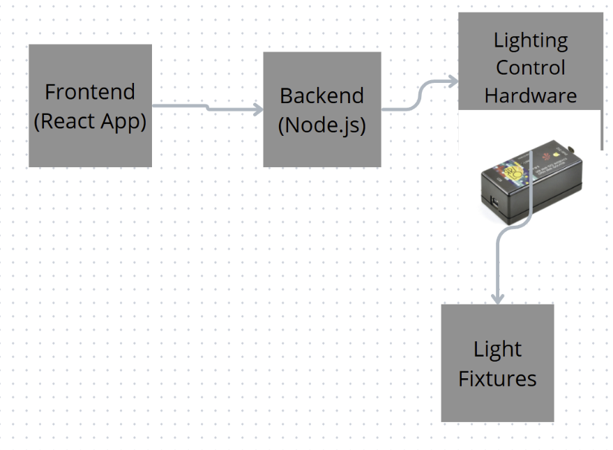
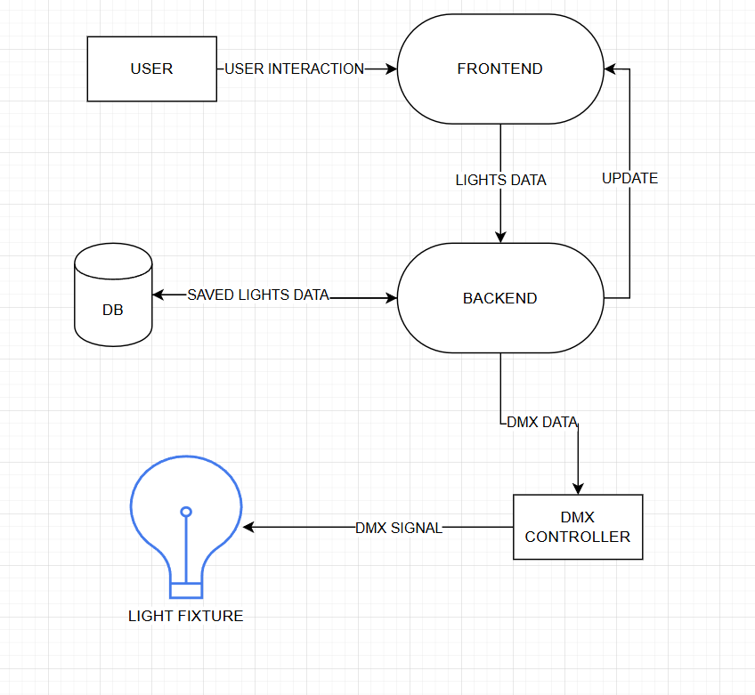
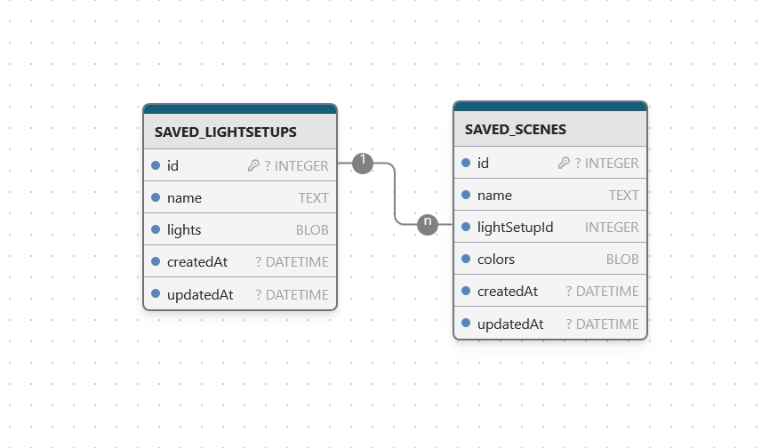

# DMX Control

DMX Control is a project designed to manage and control DMX lighting systems. This project includes both a backend server and a frontend application to provide a comprehensive solution for DMX lighting control.

## Getting Started

Follow these instructions to set up and run the project on your local machine.

### Prerequisites

Ensure you have the following software installed on your machine:

- Node.js (https://nodejs.org/)
- npm (Node Package Manager, comes with Node.js)

### Installation

### Configuration

Before running the backend server, ensure you update the COM port value in the `dmxRouter.js` file to match your DMX interface's COM port. Open the file and modify the following line:

```javascript
const universe = dmx.addUniverse("demo", "enttec-open-usb-dmx", "COM9");
```

Replace `"COM9"` with the appropriate COM port for your DMX interface.

Open two terminal/command prompt tabs to run the backend and frontend simultaneously.

#### Running the Backend

1. Navigate to the backend directory:
    ```sh
    cd dmx-control/backend
    ```

2. Install the backend dependencies:
    ```sh
    npm install
    ```

3. Start the backend server:
    ```sh
    node index.js
    ```

#### Running the Frontend

1. Navigate to the frontend directory:
    ```sh
    cd dmx-control
    ```

2. Install the frontend dependencies:
    ```sh
    npm install
    ```

3. Navigate to the `src` directory:
    ```sh
    cd src
    ```

4. Start the frontend application:
    ```sh
    npm start
    ```

## Application Documentation

### Short Description

DMX Control is a comprehensive solution for managing and controlling DMX lighting systems. The application consists of a backend server and a frontend application, providing real-time control and smooth transitions for DMX values. Users can manage scenes, cycle through scenes, and control individual lights through an intuitive web interface.

### Architecture Diagram



#### Description

- **Frontend**: A React-based web application that provides the user interface for controlling the DMX lights.
- **Backend**: An node.js server that handles API requests from the frontend and communicates with the DMX controller.
- **DMX Controller**: A hardware interface that sends DMX signals to the connected lights.

### Data Flow Diagram



#### Description

1. **User Interaction**: The user interacts with the frontend application.
2. **API Requests**: The frontend sends API requests to the backend server.
3. **DMX Commands**: The backend processes the requests and sends DMX commands to the DMX controller.
4. **Light Control**: The DMX controller adjusts the lights based on the received commands.

### Database Diagram



#### Description

- **Scenes**: Stores information about different lighting scenes, including light settings and configurations.
- **Lights**: Stores information about individual lights, including their DMX addresses and current settings.

### APIs Usage

#### Set Channel

**Endpoint**: `/set-channel`

**Method**: `POST`

**Description**: Sets the value of a specific DMX channel.

**Request Body**:
```json
{
  "channel": 1,
  "value": 255
}
```

**Response**:
```json
{
  "message": "Channel 1 set to 255"
}
```

#### Set Cycle

**Endpoint**: `/set-cycle`

**Method**: `POST`

**Description**: Starts cycling through a series of lighting scenes.

**Request Body**:
```json
{
  "sceneLightsArrays": [
    // Array of scenes with light settings
  ],
  "interval": 10000
}
```

**Response**:
```json
{
  "message": "Cycle effect started"
}
```

#### Stop Cycle

**Endpoint**: `/stop-cycle`

**Method**: `POST`

**Description**: Stops the cycling of lighting scenes.

**Response**:
```json
{
  "message": "Cycle effect stopped"
}
```

#### Set Scene

**Endpoint**: `/set-scene`

**Method**: `POST`

**Description**: Sets a specific lighting scene.

**Request Body**:
```json
{
  "lights": [
    // Array of light settings
  ]
}
```

**Response**:
```json
{
  "message": "Scene set"
}
```
